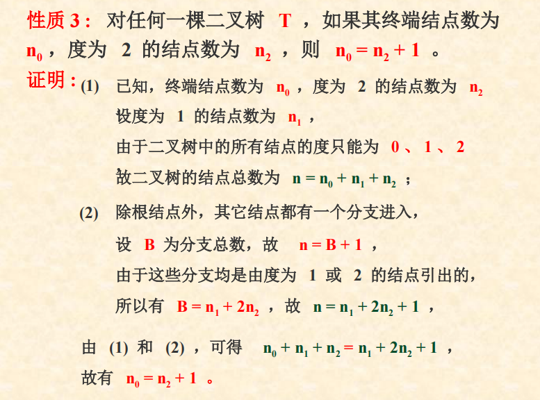

# 6.1 tree
## definition
- a limited set with level structure

## degree
- number of subtree

## 


## operation
```
// Root


//Value()


//Parent()


//LeftChild()


//RightSibling()


//TreeEmpty()


//TreeDepth()


//TraverseTree()


```
# 6.2 BiTree
## definition
- sequential storage

## properties
- depth=k
### 1.last level
>maximum number=2^(i-1)
>minimum number=1

### 2.sum nodes
- 2^k-1

### 3.
$n_0=n_2+1$


### 4.Full binary tree | Complete Binary Tree
- Full--


#### complete binary tree's depth
  $\lfloor x \rfloor$