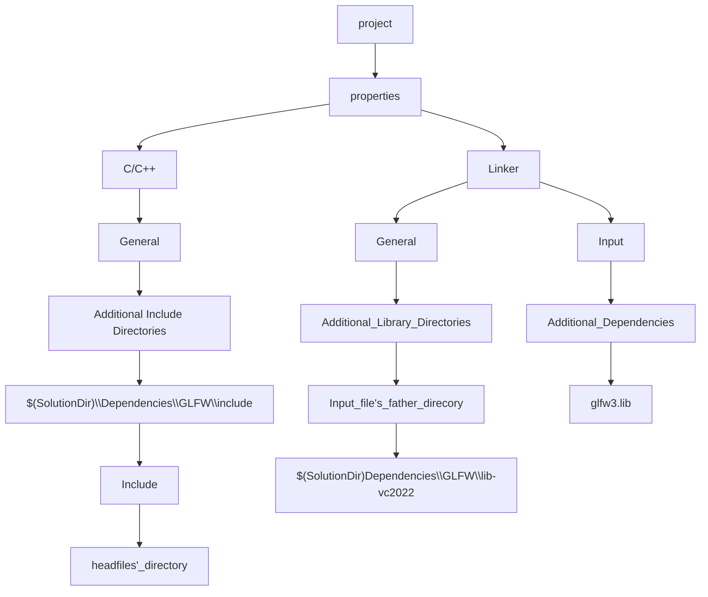

# quick key
1. ctrl + f7--compile
# dependencies
## setting in vs2022


## extern "C"
- translate C file or function in c into c++
```
extern "C" int glfwInit();
```


## Attention
1. library need to match your project's target platform