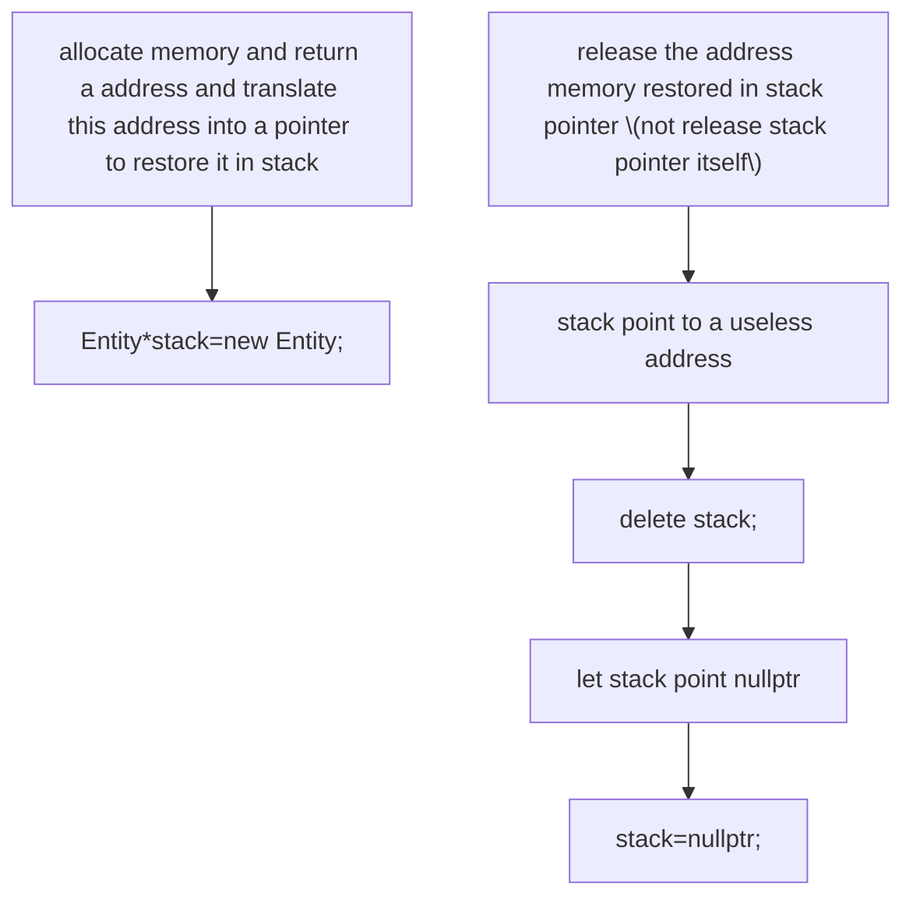

<style>
    h1,h2,h3,h4,h5,h6{font-size:22px !important;}
</style>
# 1. * &
## 1.1 *
  >a.when in function:de reference
  >means get the value from a pointer
  
  >b.when in declaration: declare pointer parameter

## 1.2 &
  >a.when in declaration(Only cpp):reference
  >return the true value of this parameter
  
  >attention: free can't used on reference
  >because free works only on pointer, but & return a value 

# 2. -> .
## 2.1 ->
> work on pointer(*)
## 2.2 .
> work on value or reference(&)

# 3. malloc
## 3.1 grammar
- c++
```c++
Stack_Own * stack_1=(Stack_Own *)malloc(sizeof(Stack_Own))
```
>here need translate ir into the type of(Stack_Own)
>because malloc only allocates the memory
>c++ don't allow 隐式转换

- c
```c
Stack_Own* stack_1=malloc(sizeof(Stack_Own))
```
# 4. new | malloc

## 4.1 new 
- in c++ did three things:
  >1.allocate memory
  >2.translate type
  >3.use the construction function
### 4.1.1 grammar
```
Entity * a1=new Entity;
```
```
a1->data=new int[a1->capacity];
```
```
Entity *a1=new{nullptr,1,0};//data capacity size
```
### 4.1.2 delete
```
//array
a1->data=new int[a1->capacity];
delete[] a1->data;
```
```
delete a1;
```
  
# 5. stdbool.h
- make bool available

# 6.NULL | nullptr
- pointer
  >can't resign to a integer or anything else
