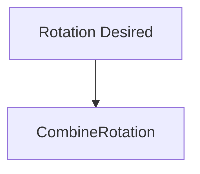

# problem haven't solve
<a href="#combine-rotators">CombineRotators</a>

# Words
- 1. zoom
- 2. minus
- 3. counterclockwise
- 4. clockwise

# 1.Spring Arm
- set actor axis
## 1.1 Camera
- if inheritate it under Spring Arm, it will follow the actor axis to set camera towards

## 1.2 Camera Collision
- turn off '**do collision test**'

# 2. project setting
## Engine--Input
### Action Mapping
- allow Press and Release

### Axis Mappings
- allow Press

# 3. Event Tick
## 3.1 Delta Seconds
- engine fps time
## 3.2 Forward Right
### Camera Speed Forward Right
- a own parameter to control Axis Value
### Get Actor Right Vector
- make sure rotate base on Actor Axis
## 3.3 Zoom
### Clamp
- limit the camera movement
## 3.4 Rotate camera

- <a id="combine-rotators">combine rotators</a>
> set 45 to Q (Clockwise)
> set -45 to E(Counerclockwise)
## 3.5 Interp To
>make movement smoothy
- Current
- Target
- Delta Time
  >Connect [Delta Seconds](#31-delta-seconds)
- Interp Speed
# 4. Event Begin Play
- initialize the parameter to prevent camera fast movement at the beginning
## GetActorLocation
- set location_Desired
## GetActorRotation
- set rotation_Desired

## Spring Arm --target
- set zoom_desired