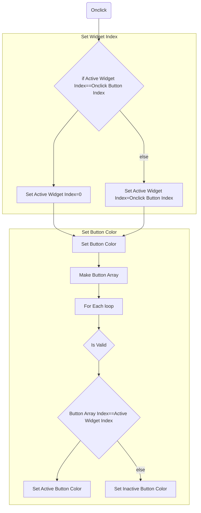

# words

# 1. use interface
- widget blueprints
  >interface button
# 2. widget blueprints
- vertical box
- horizental box
## 2.1 inherit
- change inherit can change change the relationship in different buttons
## 2.2 WidgetSwitcher
- offer switch button

# 3. button blueprint

## 3.1 Onclick
- examine button click
## 3.2 Get Active Widget Click
