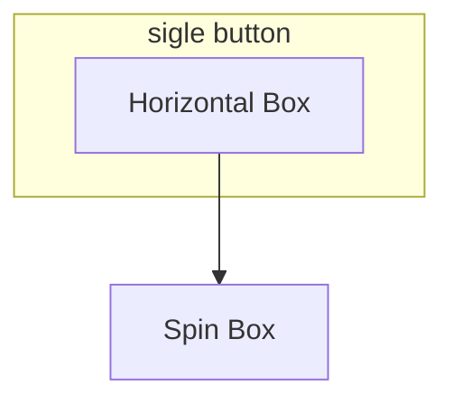
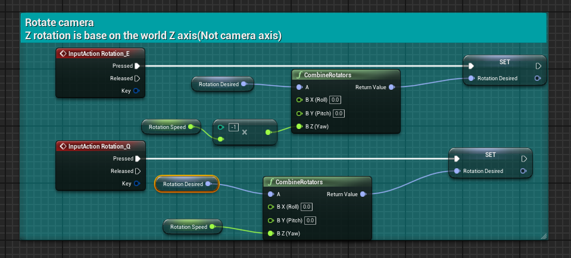
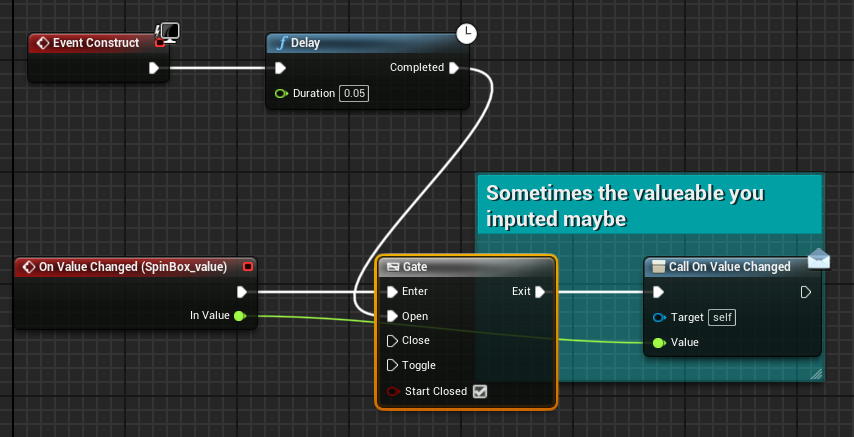
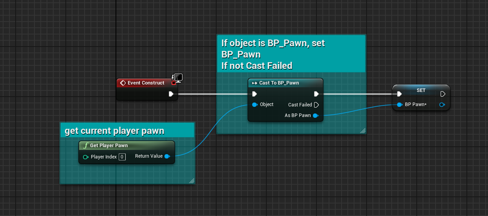
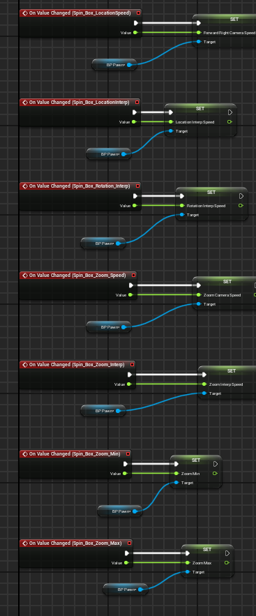
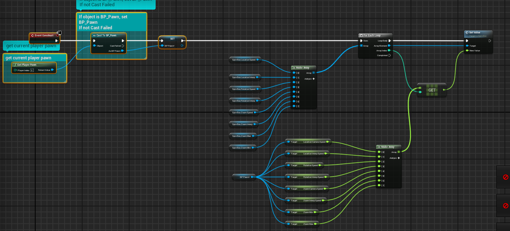

# words
- anchors
  >锚点

# 0. make speed value
- rotation have a little problem because you need to remain this x and y but you still need to change its z, here is the solution

# 1. Spin Box
## 1.1 content
- maxmium | minimum slider value
  >control the edge of this box show

## 1.2 style
- forground color
  >change text color

- background brush
- hovered background
- active fill brush
- inactive fill brush

## 1.3 Event Dispatchers
???
- set own function

## 1.4 same as Is valid(own type)

- gate
  >if "open" exit to next point

- delay control the input value change time
  >if too fast may cause broken

## 1.4 check actor pawn
- check pawn, if the actor pawn is "BP_Pawn", set this blueprint's "BP_Pawn" as BP_Pawn
if not, failed to other

## 1.5 set value
- actually there need multiple "Is valid" but [1.4](#14-same-as-is-validown-type) have down

## 1.6 Pre Construct

