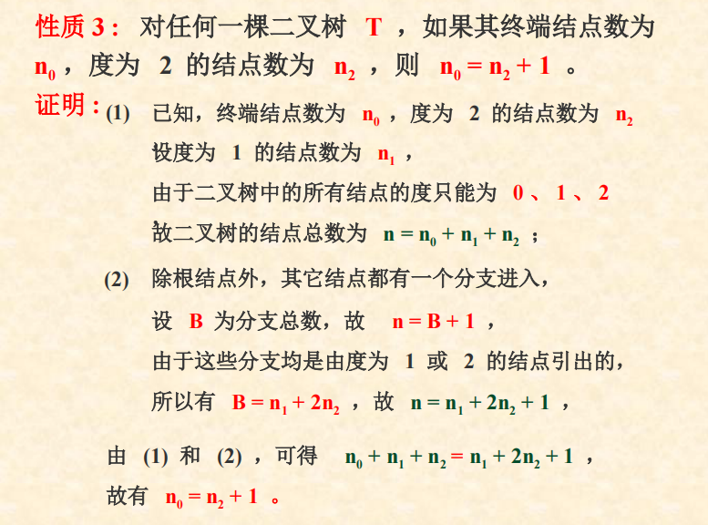

<style>
  h1,h2,h3,h4,h5,h6{font-size:22px !important}
</style>

# words

- 1. tranversal
# 6.1 tree
## definition
- a limited set with level structure

## degree
- number of subtree

## 


## operation
```
// Root


//Value()


//Parent()


//LeftChild()


//RightSibling()


//TreeEmpty()


//TreeDepth()


//TraverseTree()


```
# 6.2 BiTree
## definition
- sequential storage

## properties
- depth=k
### 6.2.1.last level
>maximum number=2^(i-1)
>minimum number=1

### 6.2.2.sum nodes
- 2^k-1

### 6.2.3.
$n_0=n_2+1$


### 6.2.4.Full binary tree | Complete Binary Tree
- Full binary tree
  >every level is full
- Complete Binary Tree
  >only last level have empty node(**must completely empty**)
  
  >and only **right** node can be empty
### 6.2.5.


#### complete binary tree's depth
  $\lfloor x \rfloor$
# 6.3 storage stucture
## 6.3.1 linear storage structure
- all use full binary tree

- backdrop:
  >storage waste
## 6.3.2 LinkList
### realization-
```
typedef struct BinaryTreeLinkList{
  DataElement data;
  struct BiTNode *Ichild,*rchild;
}BiTNode,*BiTree;
```
### TriTNode realization
```

```


# 6.4 binary tree traversal
## realization
### Pre-order
```c++
define OK 1;
void PreOrderTraverse(BiTree targetTree)
{
  std::cout<<targetTree->data<<std::endl;
  PreOrderTraverse(targetTree->lchild);
  PreOrderTraverse(targetTree->rchild);
}
Status PreOrderTraverse(BiTree targetTree)
{
  if(targetTree)
  {
    PreOrderTraverse(targetTree);
    return OK;
  }
  else return OK;
}
```
```c++

```

### Pre-order without traversal
```c++
void PreOrder(BiTree targetTree)
{
  //initialize  
  SqStack stackDeclaration;
  InitStack(&stackDeclaration);
  BiTree tempTree=targetTree;
  //first stack node
  Push(&stackDeclaration,NULL);
  while(tempTree)
  {
    std::cout<<tempTree->data<<std::endl;//output every node (include right node)
    if(tempTree->rchild)
      Push(&stackDeclaration,tempTree);
    if(tempTree->lchild)
      tempTree=tempTree->lchild;  
    else Pop(&stackDeclaration,tempTree);//directly point its rchild
  }

}
```
### work
>use traversal to count the height of a binary tree

>count the leaf node of a binary tree