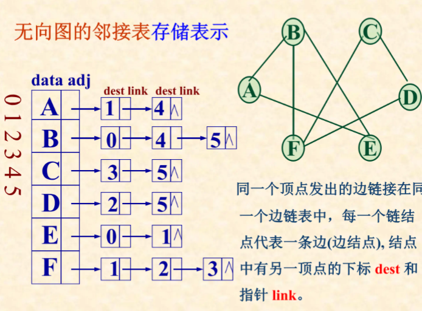
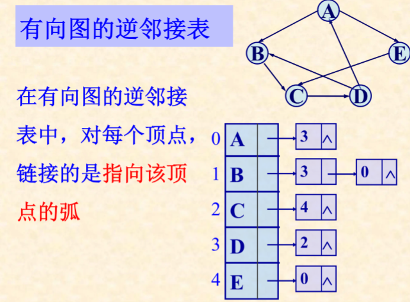
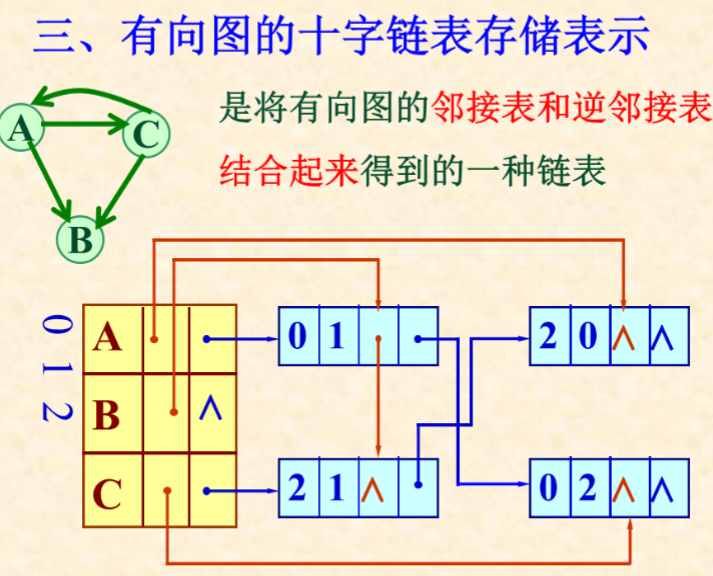

<style>
    h1{font-size:25px !important}
    h2{font-size:23px !important}
    h3{font-size:21px !important}
    h4{font-size:19px !important}
    
</style>
# 7.1 graph
## 7.1.1 definition

## 7.1.2
### 
- <v,w>
  >v --tail
  >w --head
- no arrow graph
  >
- arrow graph
  >
## 7.1.3 net
- number of edge? -- e
  - direction
  >$0<=e<=n(n-1)$
  - no direction
  >$0<=e<=(n)(n-1)/2$
# 7.2 storage
## 7.2.1 Adjacency Matrix -- array
## 7.2.2 Adjacency List




- **Attention!**
  >arrow position!


### 7.2.3 Orthographic? Linklist


### 7.2.4 No_direction multiple linklisy storage
edge
```c++
typedef struct{
    int root;
    char name;
    int tail;
    int arrow;
    int * tail;
    int * head;
}Edge;

typedef struct{
    int name;
    int * firsthead;
}
```