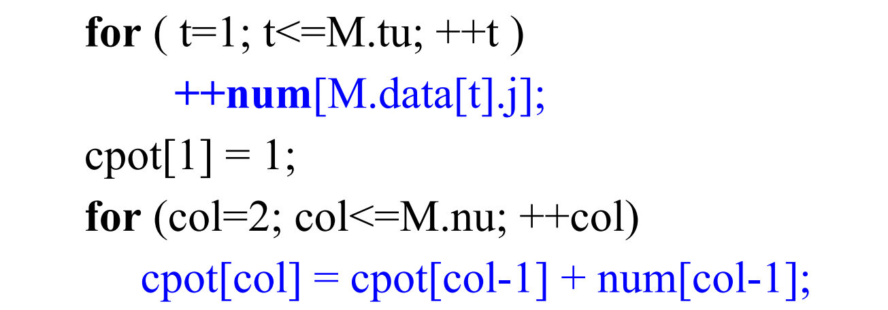
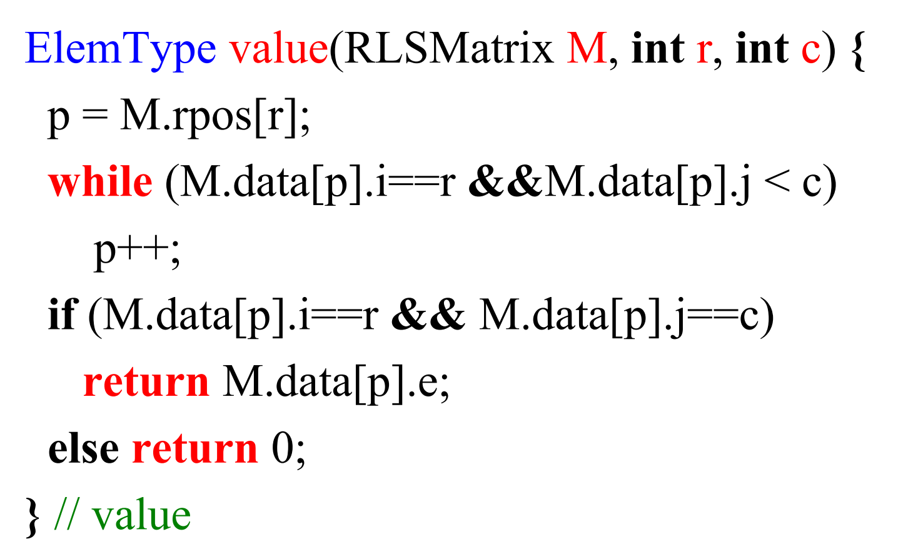
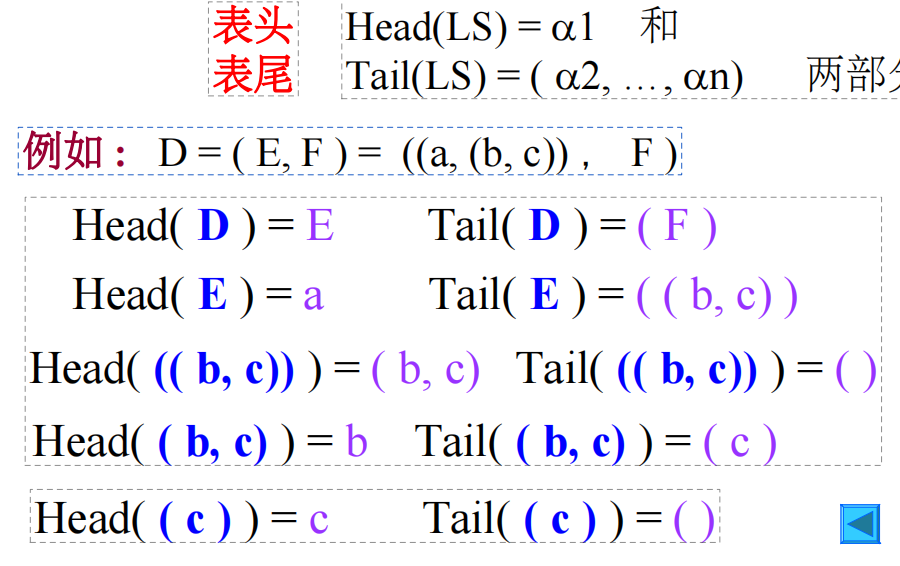

# 5.1
## test
> 1. get a array elemt 's adress
> i[0,0]+(bi+j)

> 2. n dimensions array
> Loc(j1,j2,...,jn)=Loc(0,0,0)+(b2)i
>

##
(i-1)*2+j-1


## triple
### definition
```
typedef struct
{
    int i,j;
    DataType element;
}Triple;

typedef union{
    Triple data[max+1];
    int mu,nu,tu;
}Union;
```


### operation
#### matrix transposition of a triple

>go through every element in one loop (actually twice)

```
//triple

```




```
//normal
for(col=1;col<=nu;++col)
    for(row=1;row<=mu;++row)
    T[col][row]=M[row][col];
```

- Num[] record the number of element in this line
- Cpot[] record the start adress of this line in a 1 dimension array

```

```
#### matrix multiply
!

#### triple with row logic link
```
typedef struct{
    Triple data[MAXSIZE+1];
    int rpos[MAXRC+1];
    int mu,nu,tu;

}RLSMatrix;
ElemType value(RLSMatrix M,int r,int c)
{
    p=M.rpos[r];
    while(M.data[p].i==r&&M.data[p].j<c)//judge the row
    p++;
    if (M.data[p].i==r&&M.data[p].j==c)
    return M.data[p].e;
    else return 0;
}
```


### problem


- why need judge p M.data[p].i==r
# 5.3 Orthogonal Linked List

# 5.4 Genenalized List
## definition
> Recusive linear stucture

> Length
- the number of elements in the last level

> List head
- the first element


> List tail
- must a son list
- the rest of elements except the first one


# Question


