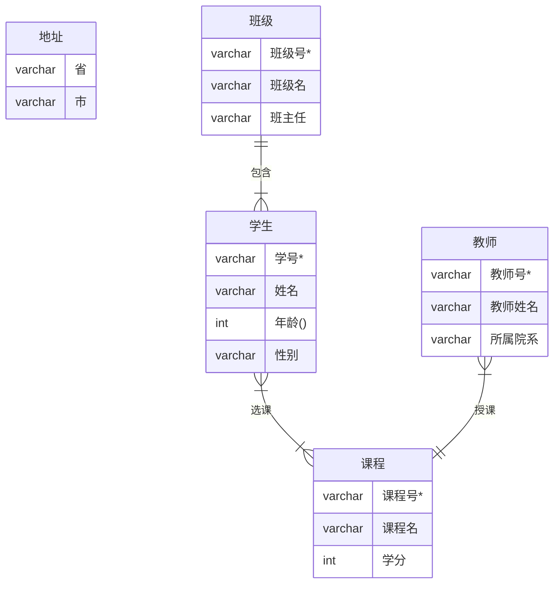
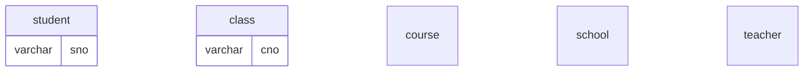

<style>
    h1,h2,h3,h4,h5,h6{font-size:22px !important;}
</style>





①部门具有部门编号、部门名称、办公地点等属性；

②部门员工具有员工编号、姓名、级别等属性

③
④实习生具有实习编号、姓名、年龄等属性，
⑤项目具有项目编号、项目名称、开始日期、结束日期等属性；

⑥

⑦

⑧

，员工只在一个部门工作；
每个部门有唯一一个部门员工作为部门经理；
一名员工只负责一个项目，可以参与多个项目，在每个项目具有工作时间比；
每个项目由一名员工负责，由多名员工、实习生参与；
每个实习生只参与一个项目。只在一个部门实习；

```mermaid
erDiagram
部门{
    varchar 部门编号
    varchar 部门名称
    varchar 办公地点
}

部门员工{
    varchar 员工编号
    varchar 姓名
    varchar 级别
}
实习生{
    varchar 实习编号
    varchar 姓名
    int 年龄
}
项目{
    varchar 项目编号
    varchar 项目名称
    varchar 开始日期
    varchar 结束日期
}
员工||--|{项目:"参与" }
```