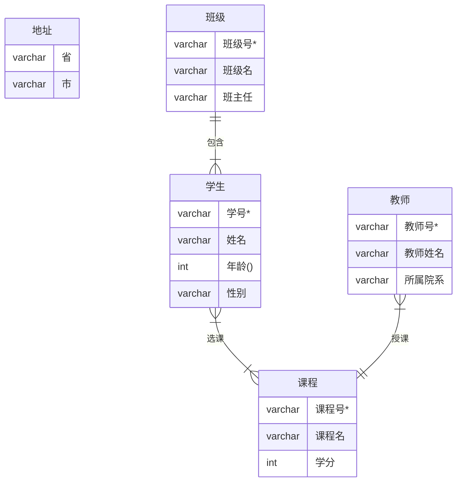

```mermaid
erDiagram
学生 {
        varchar  学号* 
        varchar  姓名
        int      年龄() 
        varchar  性别
}    
地址 {  
            varchar  省
            varchar  市
    }
班级 {
    varchar  班级号* 
    varchar  班级名
    varchar  班主任
}
课程 {
    varchar  课程号* 
    varchar  课程名
    int      学分
}
教师 {
    varchar  教师号*  
    varchar  教师姓名
    varchar  所属院系
}
%% 定义关系
班级 ||--|{ 学生 : "包含"  
学生 }|--|{ 课程 : "选课" 
教师 }|--|| 课程 : "授课" 
```