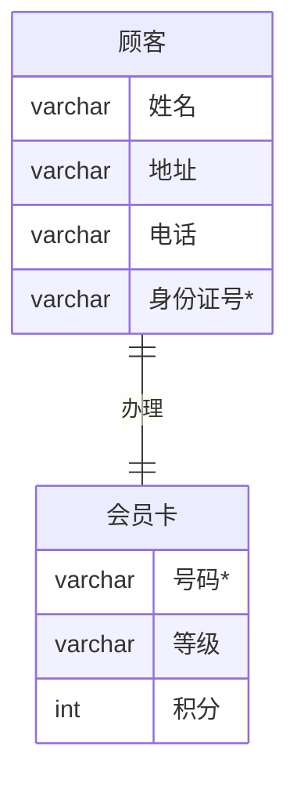
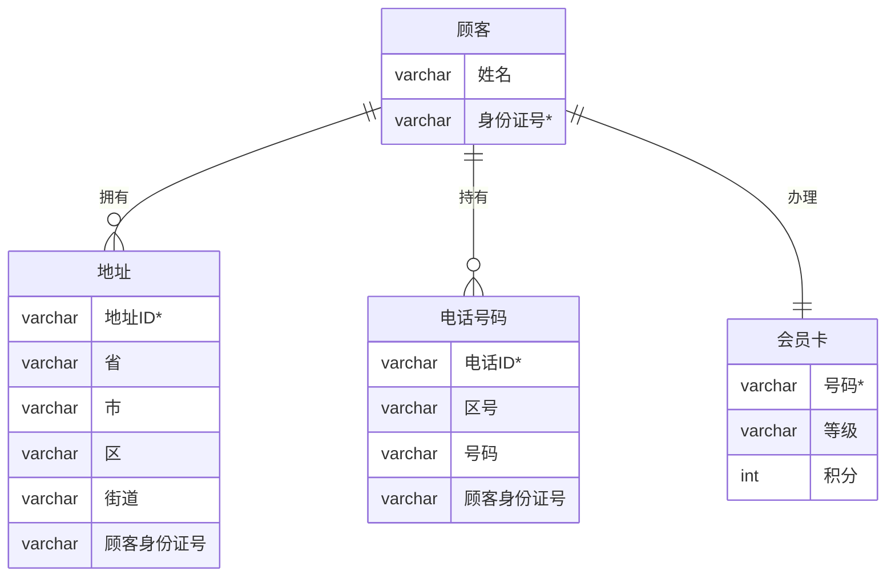
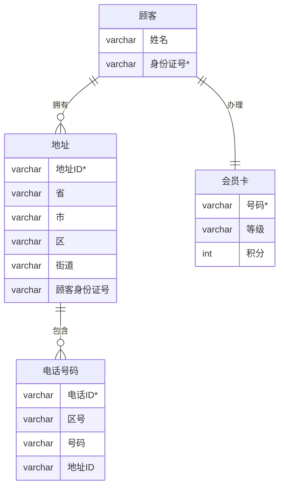
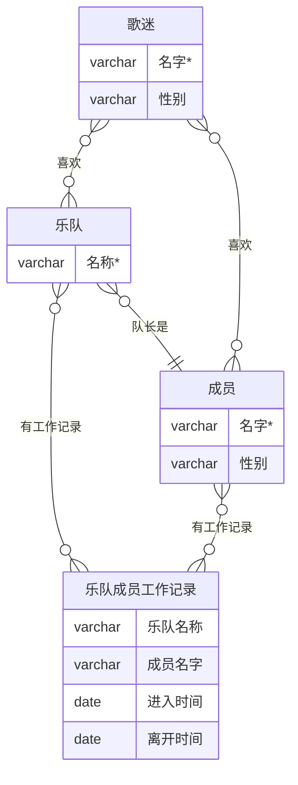
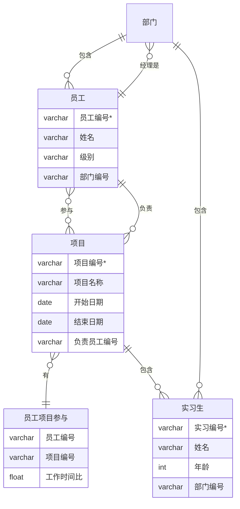

```mermaid
erDiagram
顾客 {
        varchar 姓名
        varchar 地址
        varchar 电话
        varchar 身份证号* 
    }
    会员卡 {
        varchar 号码*
        varchar 等级
        int 积分
    }
    顾客 ||--|| 会员卡 : "办理"


```

```mermaid
erDiagram


顾客 {
        varchar 姓名
        varchar 身份证号*
    }
    地址 {
        varchar 地址ID*
        varchar 省
        varchar 市
        varchar 区
        varchar 街道
        varchar 顾客身份证号
    }
    电话号码 {
        varchar 电话ID*
        varchar 区号
        varchar 号码
        varchar 顾客身份证号
    }
    会员卡 {
        varchar 号码*
        varchar 等级
        int 积分
    }
    顾客 ||--o{ 地址 : "拥有"
    顾客 ||--o{ 电话号码 : "持有"
    顾客 ||--|| 会员卡 : "办理"
```

```mermaid
erDiagram
    顾客 {
        varchar 姓名
        varchar 身份证号*
    }
    地址 {
        varchar 地址ID*
        varchar 省
        varchar 市
        varchar 区
        varchar 街道
        varchar 顾客身份证号
    }
    电话号码 {
        varchar 电话ID*
        varchar 区号
        varchar 号码
        varchar 地址ID
    }
    会员卡 {
        varchar 号码*
        varchar 等级
        int 积分
    }
    顾客 ||--o{ 地址 : "拥有"
    地址 ||--o{ 电话号码 : "包含"
    顾客 ||--|| 会员卡 : "办理"
```

```mermaid
erDiagram
    乐队 {
        varchar 名称*
    }
    成员 {
        varchar 名字*
        varchar 性别
    }
    歌迷 {
        varchar 名字*
        varchar 性别
    }
    乐队成员工作记录 {
        varchar 乐队名称
        varchar 成员名字
        date 进入时间
        date 离开时间
    }
    乐队 }o--o{ 乐队成员工作记录 : "有工作记录"
    成员 }o--o{ 乐队成员工作记录 : "有工作记录"
    乐队 }o--|| 成员 : "队长是"
    歌迷 }o--o{ 乐队 : "喜欢"
    歌迷 }o--o{ 成员 : "喜欢"
```

```mermaid
erDiagram
    员工 {
        varchar 员工编号*
        varchar 姓名
        varchar 级别
        varchar 部门编号
    }
    实习生 {
        varchar 实习编号*
        varchar 姓名
        int 年龄
        varchar 部门编号
    }
    项目 {
        varchar 项目编号*
        varchar 项目名称
        date 开始日期
        date 结束日期
        varchar 负责员工编号
    }
    员工项目参与 {
        varchar 员工编号
        varchar 项目编号
        float 工作时间比
    }

    部门 ||--o{ 员工 : "包含"
    部门 }o--|| 员工 : "经理是"
    部门 ||--o{ 实习生 : "包含"
    项目 }o--|| 员工 : "负责"
    员工 }o--o{ 项目 : "参与" 
    项目}o--|| 员工项目参与 : "有"
    项目 ||--o{ 实习生 : "包含"
```